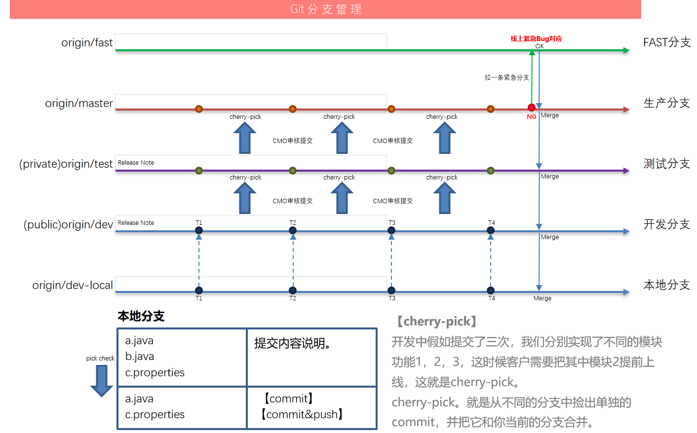
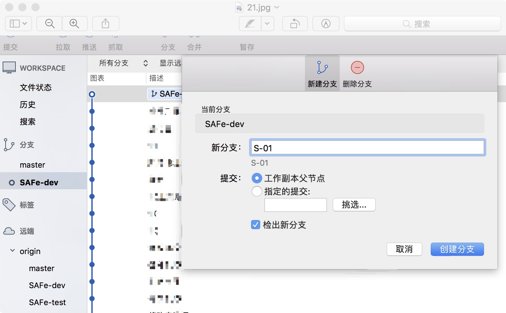
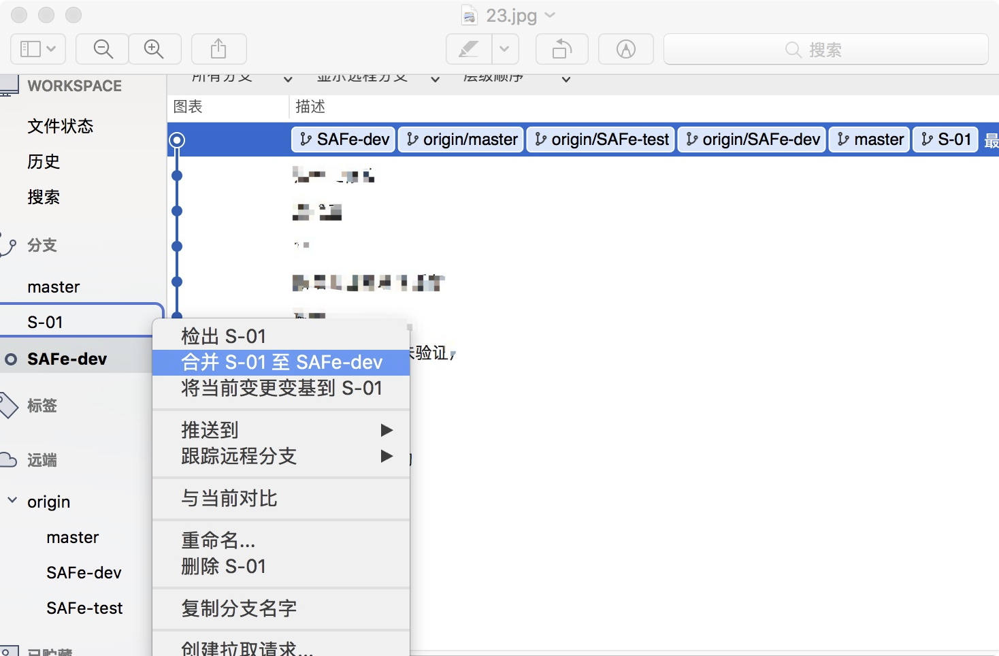
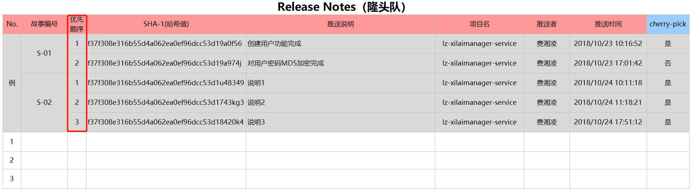

# 分支说明

## 喜来敏捷团队分支策略

以上说明为喜来敏捷团队分支策略

#### 分支说明
* `FAST`分支：紧急上线，修复问题使用  
* `生产`分支：部署上线分支
* `测试`分支：测试用分支 
* `开发`分支：团队开发用分支
* `本地`分支：程序员维护自身分支 

#### 分支对应人员 
* FAST创建：CMO
* FAST→测试→生产：CMO、开发人员
* FAST→开发：CMO
* 测试→生产：CMO
* 开发→测试：CMO
* 本地→开发：开发人员
* 本地→临时分支：开发人员

## 开发策略说明

 1. 开发人员从团队开发远端分支`dev`签出到本地`dev`分支。
 2. 本地开发人员新建`本地`分支，如`S-01`、`S-02`故事命名进行开发。
 3. 本地完成故事如`S-01`分支开发完成后，合并至本地`dev`分支。
 4. 推送本地`dev`分支至团队开发远端`dev`分支，并补充完善Release Note说明。
 5. 本地完成故事如`S-02`分支开发完成后，合并至本地`dev`分支。
 6. 推送本地`dev`分支至团队开发远端`dev`分支，并补充完善Release Note说明。
 7. CMO负责开发分支推送至测试分支，测试人员开发测试。
 8. CMO及相关人员，从测试分支推送至生产分支，以便上线部署。

 备注： 
   * 开发环境、测试环境均为自动化部署。
   * 本地推送至远端开发分支时，务必完善Release Note说明。

## 开发联调说明

 1. 所有完成的代码需推送至远程`dev`分支进行联调。
 2. 代码有修改，参考开发策略，先进行本地故事分支修改，合并，再推送至远端进行联调。
 
 
如：开发签出`SAFe-dev`，故事为`S-01`进行开发：

## Release Note说明 

各组维护自己团队的Release Note说明文档。
每进行一次推送至`dev`分支需要记录一次Release Note。

1. 假设A（Java）、B（Web）、C（Android）、D（iOS）4位同学同时开发同一个`S-01`故事。
2. 他们在开发完毕后，推送至`dev`分支（每次push需记录hashcode）；
3. 测试的同学在dev环境对该功能进行验证（功能测试），如果测出bug，开发的同学及时修复，并将代码提交至`dev`分支以供测试的同学验证（每次push需记录hashcode至Release Note）；
4. 最后做集成测试时，如果测试发现该用户故事还有bug，研发修复后，依然要将push的hashcode记录至Release Note的`S-01`故事下

备注：

1. 红色表头部分由开发人员填写、蓝色表头部分由CMO填写。		
2. 红色表头的优先顺序是指COM人员通过cherry-pick手段要Merge的顺序，注意顺序不要写错写反了。			

