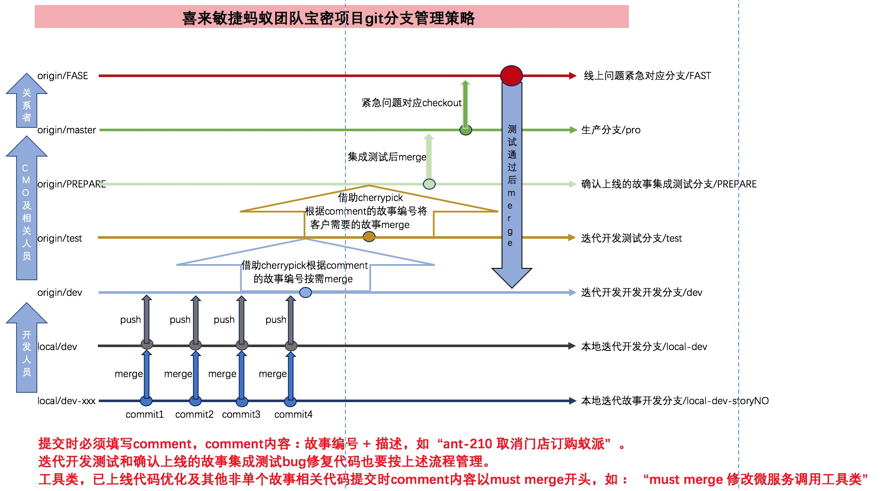

# 分支说明

## 喜来敏捷蚂蚁团队宝密项目git分支管理策略

以上说明为喜来敏捷蚂蚁团队，宝密项目，PI1迭代3，git分支管理策略。

#### 分支说明
* `FAST`分支：紧急上线，修复问题使用  
* `生产`分支：部署上线分支
* `PREPARE`分支：客户确认上线故事集成测试和bug修复使用
* `测试`分支：测试用分支 
* `开发`分支：团队开发用分支
* `本地`分支：程序员维护自身分支 

#### 分支对应人员 
* FAST创建：CMO
* FAST→测试→生产：CMO、开发人员
* FAST→开发：CMO
* 生产→PREPARE：CMO
* PREPARE→生产：CMO
* PREPARE→测试：CMO
* 测试→开发：CMO
* 本地→开发：开发人员
* 本地→临时分支：开发人员

## 开发策略一：根据故事建立独立的本地故事开发分支 （推荐）

 1. 开发人员从团队开发远程分支`dev`clone到本地`dev`分支。
 2. 开发人员新建`本地故事开发`分支，如`localdev-ant-210`。推荐本地故事开发分支命名规范：分支环境 + jira故事编号。
 3. 推送代码到远程分支。 3.1 提交。必须填写comment，comment内容：故事编号 + 描述，如“ant-210 取消门店订购蚁派”。 3.2 合并，将要提交的代码所在的本地故事开发分支合并到本地开发分支（与远程开发分支对应的本地开发分支）。 3.3 推送本地开发分支到远程开发分支。
 4. CMO（配置管理员）借助cherrypick按需合并远程开发分支到测试分支。测试人员测试。
 5. CMO从生产生分支拉出PREPARE分支。从test分支把客户确认要上线的故事借助cherrypick合并到PREPARE分支。测试人员做集成测试。此时测试出来的bug在对应的本地PREPARE分支上修改并push到远程PREPARE分支后进行回测。回测通过后合并远程PREPARE分支到远程test分支和远程dev分支。
 6. 测试通过后，CMO及相关人员将PREPARE合并到生产分支，以便上线部署。

 备注： 
   * 开发环境、测试环境均为自动化部署。
   * 上述开发策略一中第三步中的comment内容至关重要，是CMO借助cherrypick按需合并远程分支时重要依据。
   * 工具类，已上线代码优化及其他非单个故事相关代码提交时comment内容以must merge开头，如： “must merge 修改微服务调用工具类”

## 迭代开发联调说明
 1. 迭代任务和bug修复完成的代码需推送至远程`dev`分支进行联调。
 2. 代码有修改时也要按开发策略规范提交代码。

## 集成测试联调
 1.集成测试是基于远程`PREPARE`分支进行。集成测试bug修复并回测通过后要及时合并代码到远程分支和开发分支

## FAST分支，紧急上线，修复问题使用说明
 1.遇到需要紧急对应的线上问题时，从生产分支拉取`FAST`分支进行问题的对应和测试。测试通过后合并到生产环境进行上线，同时将FAST分支合并到PREPARE，测试，开发分支。

